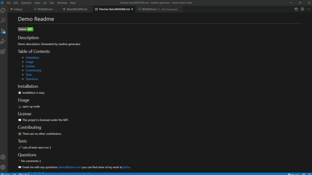
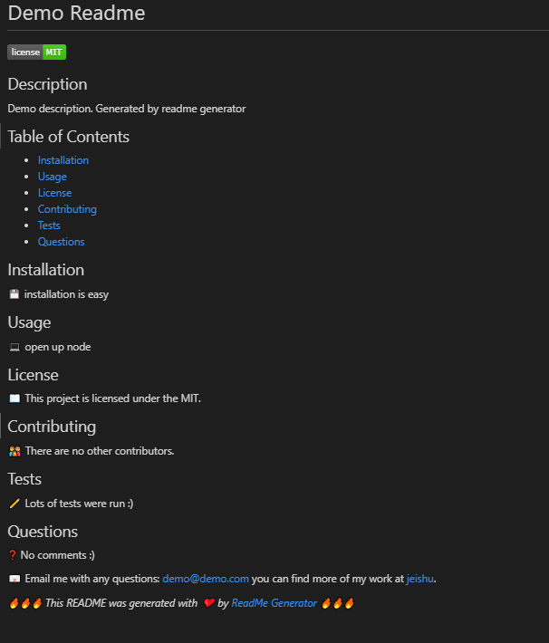

# Readme Generator

​
## Description
​
This application is intended to help developers create a README file without the hassle of learning the syntax for a markdown file.

Demo Gif




Demo Picture


​
## Table of Contents 
* [Installation](#installation)
​
* [Usage](#usage)
​
* [License](#license)
​
* [Contributing](#contributing)
​
* [Tests](#tests)
​
* [Questions](#questions)
​
## Installation
​
💾 
``` 
npm i 
```  
``` 
node index.js 
```

## Usage
​
💻 You first open the application on your GIT BASH or terminal. Type the command of: node index.js. This will lead to a series of questions for you fill out. Then it will generate all the stylings for you.
​
## License
​
📖 This project is licensed under the MIT.

## Contributing
​
👪 There are no contributors.
​
## Tests
​
✏️ Several tests were done. I started with one question to make sure it was rendering the title and description, then add more as I continue. Then added a validation for areas that need to have an answer filled. Before all that, I added "promises" to ensure the code runs smoothly.

## Questions
​
❓ This README for was created using the readme generator application with node.js and through the GIT BASH terminal. This demostrates that the application is usable.

📧 Email me with any questions: jeremy.zhu@utexas.edu
you can find more of my work at [Jeishu](https://github.com/jeishu).


_🔥🔥🔥 This README was generated with ❤️ by [ReadMe Generator](https://github.com/jeishu/readme-generator) 🔥🔥🔥_